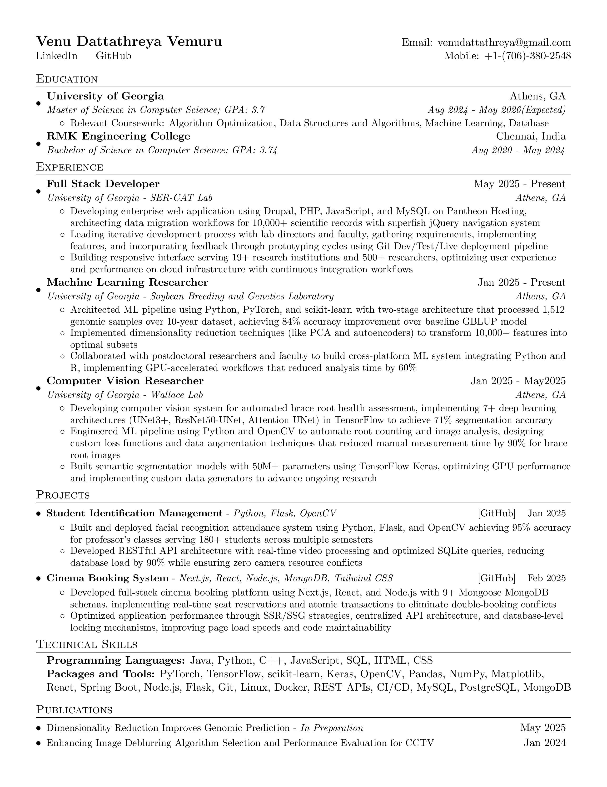

# Venu Dattathreya Vemuru - Resume
This repository contains my professional resume created with LaTeX.
## Current Resume

## How to Use
1. Clone this repository
2. Edit `resume.tex` file
3. Compile with LaTeX or use Overleaf
*Last updated: $(date '+%Y-%m-%d %H:%M:%S')*
